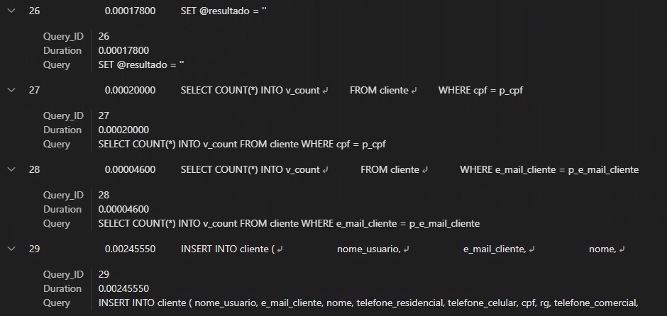

# Task 5 (IFSP) - Store Procedure

Para entender melhor como utilizar *stored procedures* de forma descomplicada, é necessário compreender o que são, quando utilizá-las e se há ganho de performance no banco de dados.

*Stored procedures* são conjuntos de comandos SQL pré-compilados e armazenados diretamente no banco de dados. Elas permitem aplicar regras de negócio no próprio banco, evitando a exposição desnecessária dos dados e proporcionando um controle mais eficiente, sem que essas informações precisem sair desse ambiente.

Em um cenário real, podemos utilizar uma *stored procedure* para realizar operações no banco de dados, sendo ela responsável por controlar o fluxo e aplicar validações de acordo com as regras definidas em sua implementação.

## Diferença entre Procedure e View

Uma `view` é tratada como se fosse uma tabela pelo banco de dados. Na prática, trata-se de um `SELECT` armazenado, utilizado para facilitar a reutilização de consultas e o acesso aos dados. Vale destacar que, na maioria dos casos, uma *view* não armazena dados fisicamente, funcionando como uma consulta virtual.

Já as *stored procedures*, como o próprio nome sugere, são sequências de comandos que podem incluir instruções *DML*, como `SELECT`, `UPDATE` e `INSERT`. Em alguns casos, também podem envolver comandos *DDL*, como `CREATE TABLE`, embora esse não seja o uso mais comum. Uma *stored procedure* pode ou não receber parâmetros e também pode retornar dados.

Podemos enxergar uma `view` como um recurso voltado exclusivamente para consulta de dados, conforme definido pelo desenvolvedor. Já uma *stored procedure* pode ser comparada a uma função, capaz de receber valores (parâmetros), executar ações, aplicar regras de negócio e realizar diferentes tipos de operações no banco de dados, podendo ou não retornar valores.

## 1. Estrutura de uma Procedure :

```sql
CREATE PROCEDURE NomeDaProcedure
    @Parametro1 INT,
    @Parametro2 VARCHAR(100)
AS
BEGIN
    -- Lógica da procedure
    SELECT *
    FROM Tabela
    WHERE Coluna = @Parametro1;

    -- Exemplo de validação
    IF @Parametro2 IS NOT NULL
    BEGIN
		    -- Resultado(Ação da Procedure)
        UPDATE Tabela
        SET OutraColuna = @Parametro2
        WHERE Coluna = @Parametro1;
    END
END;
```

Podemos enxergar uma semelhança com a estrutura de uma função em qualquer tipo de linguagem. Abaixo segue mesma lógica em uma função abaixo descrita em  `Java()`:

```java
public void NomeDaProcedure(
	int Parametro1,
	String Parametro2
)
{
	// SELECT * FROM Tabela WHERE Coluna = @Parametro1;
  // -> Em Java: buscar dados no banco
  if (parametro2 != null) {
	  // UPDATE Tabela SET OutraColuna = @Parametro2 WHERE Coluna = @Parametro1;
    // -> Em Java: atualizar dados no banco
	}
};
```

## 2. Sintaxe

### 1. Exemplo Baixa Complexidade

Segue abaixo *Procedure* formulada para buscar um usuário no banco passando o `Id`

```sql
CREATE PROCEDURE BuscarUsuarioPorId
    @Id INT
AS
BEGIN
    SELECT *
    FROM Usuarios
    WHERE Id = @Id;
END;
```

Para chamar e utilizar uma *Procedure* usamos o comando `EXEC` como no exemplo abaixo passando o parâmetro @id definido na procedure:  

```sql
EXEC BuscarUsuarioPorId @Id = 1;
```

### 2. Exemplo Média Complexidade

Podemos utilizar um cenário real para demonstrar o uso prático de uma *stored procedure* em produção. Abaixo, vemos como uma *procedure* pode ser aplicada em um sistema real.

Em vez de manter toda a lógica de tratamento de dados no backend da aplicação o que pode aumentar o risco de falhas e exposição de dados sensíveis, podemos utilizar uma *stored procedure* como uma camada adicional de controle e segurança.

```sql
CREATE PROCEDURE AtualizarEmailUsuario
    @UsuarioId INT,
    @NovoEmail VARCHAR(150)
AS
BEGIN
    SET NOCOUNT ON;

    -- Validação: se email vazio ou nulo, imprimir 'Email inválido'.
    IF @NovoEmail IS NULL OR @NovoEmail = ''
    BEGIN
        PRINT 'Email inválido';
        RETURN;
    END

    -- Validação: se usuário não existe, imprimir 'Usuário não encontrado'.
    IF NOT EXISTS (SELECT 1 FROM Usuarios WHERE Id = @UsuarioId)
    BEGIN
        PRINT 'Usuário não encontrado';
        RETURN;
    END

    -- Atualização: caso o código passe pelas tratativas anteriores a atualização 
    -- é realizada.
    UPDATE Usuarios
    SET Email = @NovoEmail
    WHERE Id = @UsuarioId;

    -- Retorno de sucesso
    SELECT 'Email atualizado com sucesso' AS Mensagem;
END;
```

### 3. Exemplo de Alta Complexidade

Podemos utilizar o exercício abaixo para exemplificar o uso de uma *stored procedure* em um cenário real.

<aside>

1ª Procedure: sp_cadastrar_cliente_validado
Enunciado: Crie uma procedure chamada sp_cadastrar_cliente_validado que realize o cadastro de um novo cliente na tabela cliente. A procedure deve receber como parâmetros de entrada: nome de usuário, e-mail, nome completo, telefone residencial, telefone celular, CPF, RG, telefone comercial e data de nascimento. Deve retornar um parâmetro de saída
(p_resultado) com o resultado da operação.

Regras de validação:
• Verificar se o CPF já existe na tabela. Se existir, retornar a mensagem: 'Erro: CPF já cadastrado!'
• Verificar se o e-mail já existe na tabela. Se existir, retornar a mensagem: 'Erro: E-mail já cadastrado!'
• Verificar se o CPF possui exatamente 11 dígitos. Caso contrário, retornar: 'Erro: CPF deve ter 11 dígitos!'
• Se todas as validações forem bem-sucedidas, realizar o INSERT e retornar a mensagem no formato: 'Cliente cadastrado com ID: [ID_gerado]'

</aside>

```sql

DELIMITER $$
CREATE PROCEDURE sp_cadastrar_cliente_validado (
    IN p_nome_usuario VARCHAR(15),
    IN p_e_mail_cliente VARCHAR(30),
    IN p_nome VARCHAR(100),
    IN p_telefone_residencial VARCHAR(11),
    IN p_telefone_celular VARCHAR(11),
    IN p_cpf VARCHAR(11),
    IN p_rg VARCHAR(9),
    IN p_tel_comercial VARCHAR(11),
    IN p_dtnasc DATE,
    OUT p_resultado VARCHAR(255)
)
BEGIN
    DECLARE v_count INT;

    -- Validação: tamanho do CPF
    IF CHAR_LENGTH(p_cpf) <> 11 THEN
        SET p_resultado = 'Erro: CPF deve ter 11 dígitos!';
    ELSE
        -- Validação: CPF duplicado
        SELECT COUNT(*) INTO v_count
        FROM cliente
        WHERE cpf = p_cpf;
        IF v_count > 0 THEN
            SET p_resultado = 'Erro: CPF já cadastrado!';
        ELSE
            -- Validação: e-mail duplicado
            SELECT COUNT(*) INTO v_count
            FROM cliente
            WHERE e_mail_cliente = p_e_mail_cliente;
            IF v_count > 0 THEN
                SET p_resultado = 'Erro: E-mail já cadastrado!';
            ELSE
                -- Insert
                INSERT INTO cliente (
                    nome_usuario,
                    e_mail_cliente,
                    nome,
                    telefone_residencial,
                    telefone_celular,
                    cpf,
                    rg,
                    telefone_comercial,
                    dtnasc
                ) VALUES (
                    p_nome_usuario,
                    p_e_mail_cliente,
                    p_nome,
                    p_telefone_residencial,
                    p_telefone_celular,
                    p_cpf,
                    p_rg,
                    p_tel_comercial,
                    p_dtnasc
                );
                SET p_resultado = CONCAT('Cliente cadastrado com ID: ', LAST_INSERT_ID());
            END IF;
        END IF;
    END IF;
END $$
DELIMITER ;
```

Mesma lógica, primeiro passamos os parâmetros de *sp_cadastrar_cliente_validado,* fazemos as verificações necessárias solicitadas pelo exercício e em seguida inserimos os dados de cliente após a validação da procedure, aumentando em mais uma camada de segurança na inserção dos dados de usuário no banco. 

## Diferença de Performance

Utilizando o código de teste abaixo podemos realizar uma analise de performance entre as operações realizadas no banco utilizando Query de INSERT pura e utilizando a Procedure com verificação dos dados passados.

```sql
SET profiling = 1;

-- Query 1: INSERT direto
INSERT INTO cliente (
    nome_usuario, e_mail_cliente, nome,
    telefone_residencial, telefone_celular,
    cpf, rg, telefone_comercial, dtnasc
) VALUES (
    'carlosmendes', 'carlos.mendes@email.com', 'Carlos Mendes',
    '1132450003', '11991230003',
    '11122233300', '111222333',
    '1145670003', '1992-03-10'
);

-- Query 2: INSERT via procedure  
SET @resultado = '';
CALL sp_cadastrar_cliente_validado(
    'anapaula', 'ana.paula@email.com', 'Ana Paula Lima',
    '1132450004', '11991230004',
    '44455566600', '444555666',
    '1145670004', '1995-11-30',
    @resultado
);

SHOW PROFILES;
```

Resultado Query 1 : 


Imagem dos resultados da Query executada por INSERT direto.

Resultado Query 2 :



Imagem dos resultados da Query executada por Procedure.

Como a procedure realiza verificações internas antes de inserir o dado, o `SHOW PROFILES` nos permite enxergar o tempo de cada etapa individualmente:

**Query 25 → INSERT direto**

- Duração: `0.02524050s`
- Realizado uma operação única, sem validações

**Query 26-29 → INSERT via Procedure**

- `SET @resultado` → `0.00017800s` - inicialização da variável.
- `SELECT COUNT(*) CPF`  → `0.00020000s` - validação de CPF duplicado.
- `SELECT COUNT(*) e-mail` → `0.00004600s` - validação de e-mail duplicado.
- `INSERT INTO cliente` → `0.00245550s` - inserção em si.

O tempo total da procedure (`0.00287950s`) foi menor que o INSERT direto (`0.02524050s`), evidenciando que o custo das validações internas é baixo e não compromete a performance.

## Conclusão

***Stored procedures* são uma ferramenta poderosa para centralizar lógica e validações diretamente no banco de dados, reduzindo o tráfego entre aplicação e servidor e adicionando uma camada extra de segurança e controle. Como vimos nos exemplos práticos e no teste de performance, o custo das verificações internas é baixo e o ganho em organização e segurança justifica sua utilização em cenários onde regras de negócio precisam ser aplicadas de forma consistente e eficiente.**

## Referências:

MANIA, Flávio. Banco de Dados: Stored Procedures. IFSP - Instituto Federal
de São Paulo, Campus Itapetininga, 2025. Material didático (Aula 18).
Acesso em: 21 abr. 2026.

DEVMEDIA. Stored Procedures no MySQL. Disponível em:
[https://www.devmedia.com.br/stored-procedures-no-mysql/29030](https://www.devmedia.com.br/stored-procedures-no-mysql/29030).
Acesso em: 21 abr. 2026.

W3SCHOOLS. SQL Stored Procedures. Disponível em:
[https://www.w3schools.com/sql/sql_stored_procedures.asp](https://www.w3schools.com/sql/sql_stored_procedures.asp).
Acesso em: 21 abr. 2026.