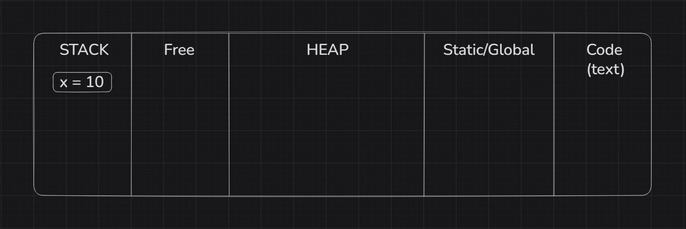
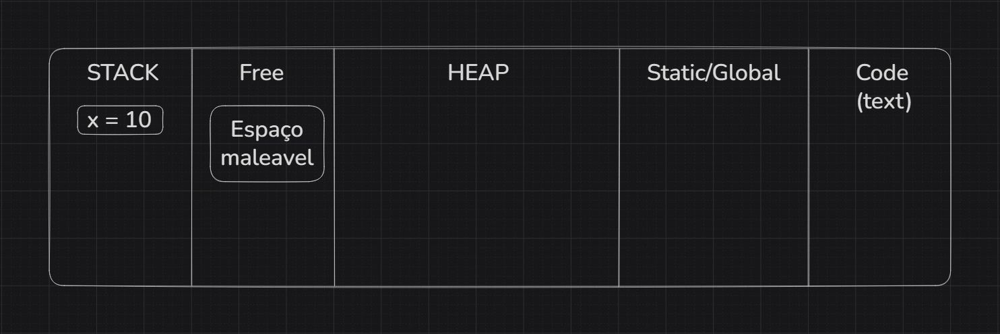
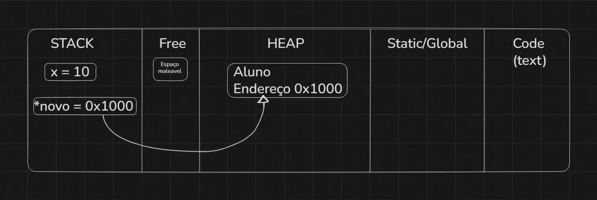
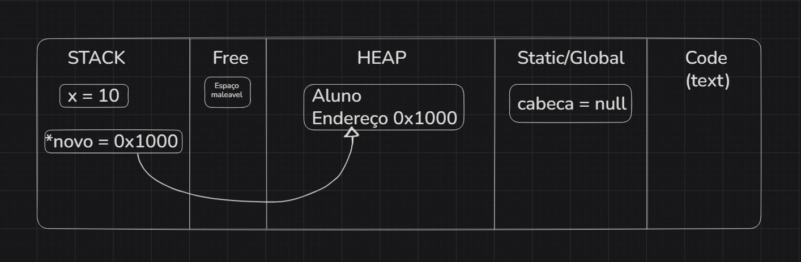
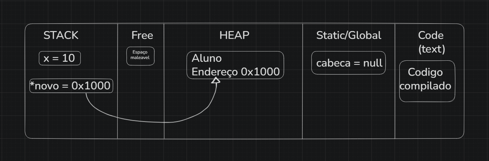

# STACK & HEAP

Quando falamos sobre STACK e HEAP estamos falando sobre as camadas em que nosso programa atua, mais especificamente sobre as duas regiões especificas da memória RAM que ele utiliza durante a execução.

A memória RAM é gerenciada pela linguagem c em 5 regiões durante sua execução sendo elas:

## 1. STACK

A Stack (pilha) é a região onde o programa armazena automaticamente as variáveis locais e os parâmetros de funções. Ela funciona como uma pilha de pratos: cada vez que uma função é chamada, um "bloco" com suas variáveis é empilhado. Quando a função termina, esse bloco é removido automaticamente e a memória é liberada. O programador não precisa se preocupar com isso.

O tamanho da Stack (pilha) em sistemas modernos é geralmente pequeno, variando entre 1MB (Windows) a 8 MB ou 10 MB (Linux/macOS) por thread.

```c
void funcao() {
    int x = 10; // mora aqui, some quando a função termina
}
```



## 2. Free

Um espaço livre entre a stack e o heap. Servindo de "folga" disponível para ambos crescerem. A stack cresce para um lado, o heap para o outro.



## 3. HEAP

O Heap é a região de memória dinâmica, onde o programa controla manualmente a alocação. É aqui que o malloc atua, ele reserva um espaço no heap e devolve o endereço desse espaço para uma variável na Stack. Diferente da stack, essa memória não é liberada automaticamente: o programador é responsável por chamar free() quando não precisar mais daquele espaço. Se isso não for feito, ocorre o que chamamos de memory leak a memória fica reservada sem ser usada.

```c
void funcao() {
    malloc(sizeof(Aluno)); // alocou mas não guardou o endereço
                           // memory leak — perdido para sempre
}

void funcaoCorreta() {
    Aluno *novo = malloc(sizeof(Aluno)); // endereço guardado na stack
    free(novo);                          // pode liberar corretamente
}
```



Caso o endereço retornado pelo `malloc` não seja armazenado em um ponteiro, ocorre um memory leak: o espaço foi reservado no heap, mas como o endereço foi perdido, não há como acessar ou liberar essa memória com `free`. Ela permanece ocupada até o programa terminar, desperdiçando recursos.

## 4. Static/Global

Variáveis globais e estáticas. Existem durante toda a execução do programa, não somem quando uma função termina.

```c
Aluno *cabeca = NULL;
```



## 5. Code (text)

O próprio código compilado do programa. As instruções que o processador executa ficam armazenadas aqui. É somente leitura.



## 6. Stack Overflow

Devido a Stack ter um tamanho consideravelmente limitado comparado ao HEAP onde se mantem as informações consistentes. Se ultrapassarmos o limite da Stack temos o que chamamos de Stack overflow decorrida de uma recursão infinita.

Abaixo temos um exemplo de recursão infinita onde uma função retorna sua própria função infinitamente dentro do programa resultando no erro de stack overflow ou literalmente estouro da pilha.

```c
void recursaoInfinita() {    // cada chamada empilha um bloco na stack
      recursaoInfinita();      // até estourar o limite — stack overflow
}
```

---

<aside>

Referencias:

- https://www.youtube.com/watch?v=Qve5f-PgQ18
- https://www.programmerinterview.com/data-structures/difference-between-stack-and-heap/
- https://stackoverflow.com/questions/79923/what-and-where-are-the-stack-and-heap
</aside>