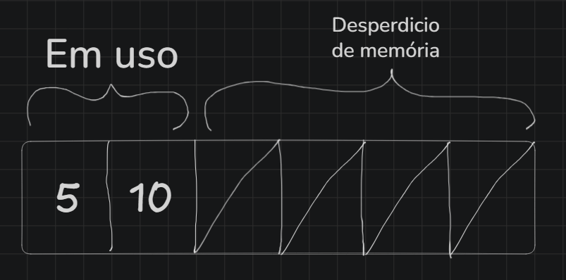
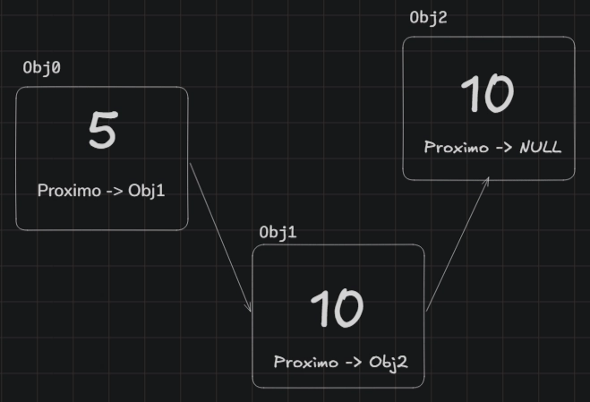
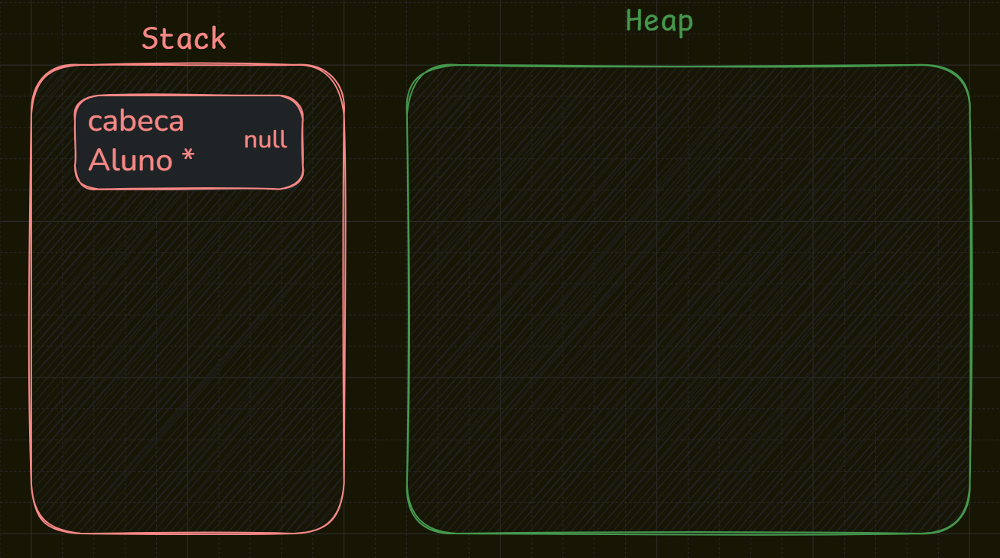
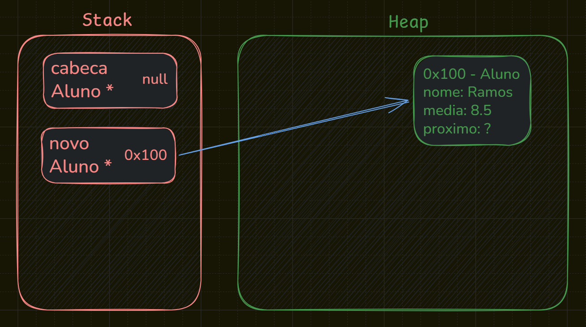
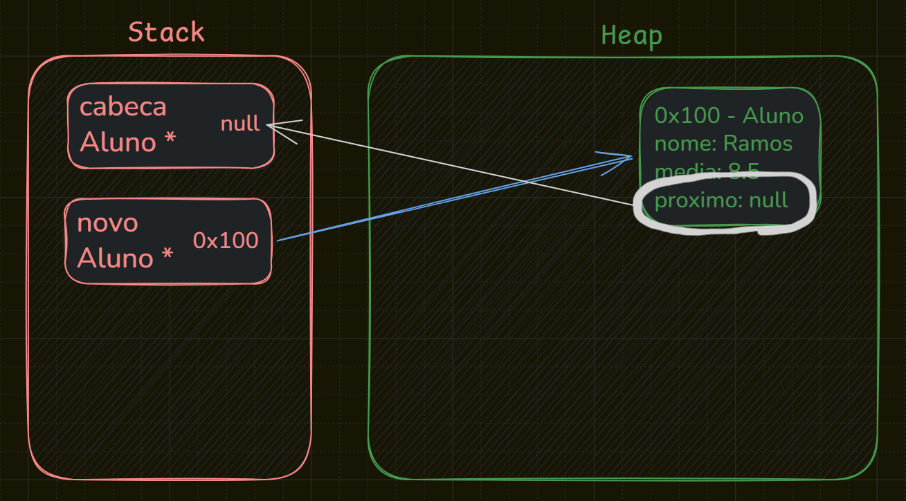
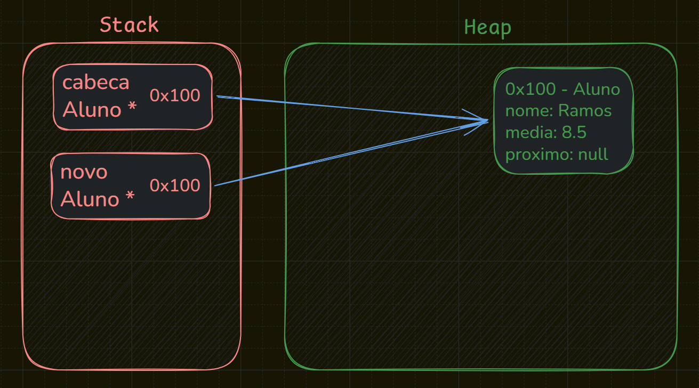
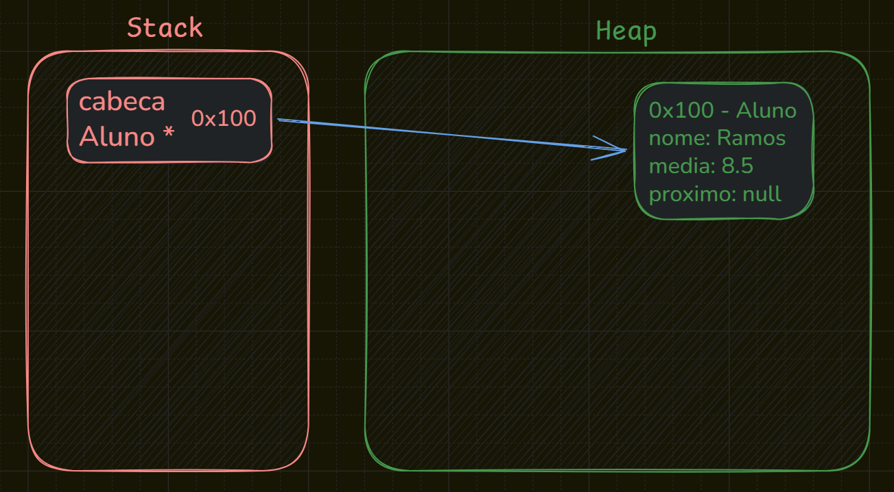

# Aula 7 - Lista Simples (in progress)

Uma lista simples nada mais é do que um vetor, podendo ser físico na memória ou virtual. Quando definimos uma lista, cada objeto na memória, mesmo estando em posições diferentes, pode ser conectado ao próximo elemento por meio de uma propriedade que o identifica. Assim, definimos uma lista simplesmente encadeada.

Uma lista é utilizada para inserir elementos dinamicamente na memória, de acordo com a necessidade de uso. Quando utilizamos um vetor, por exemplo, definimos previamente um espaço fixo na memória, ou seja, ao criá-lo, estabelecemos um tamanho específico e imutável para aquele vetor.

Podemos instanciar um vetor com tamanho 50 e utilizar apenas 10% de sua capacidade, desperdiçando os outros 90% de espaço na memória. Da mesma forma, caso utilizemos 100% da capacidade do vetor e precisemos armazenar mais elementos, não será possível expandi-lo diretamente.



É nesse contexto que entram as listas. Com elas, podemos gerenciar a memória de forma dinâmica, alocando espaço conforme a utilização, sem a necessidade de definir previamente um tamanho fixo.

Para formar uma lista, os objetos devem possuir um identificador que permita relacioná-los dentro da estrutura da lista. Para isso, utilizamos um atributo responsável por apontar para o próximo elemento. Quando esse atributo não aponta para nenhum outro elemento, significa que aquele é o último elemento da lista.



Exemplo gráfico de uma lista com objetos dinâmicos alocados em diferentes pontos da memória.

# Aplicação de uma Lista em C

## Definindo a Estrutura com `struct`

Em C, utilizamos `struct`, uma estrutura responsável por definir como será organizado o objeto a ser criado. No exemplo abaixo, temos a definição de uma estrutura para representar uma lista de alunos.

```c
typedef struct Aluno {
    char nome[50];
    double media;
    struct Aluno *proximo;
} Aluno;
```

Um ponto relevante a ser destacado refere-se ao uso de `typedef`. Em C, toda vez que fôssemos declarar uma variável do tipo estrutura, seríamos obrigados a escrever a palavra `struct` antes do nome: `struct Aluno *novo`. O typedef resolve isso criando um apelido para o tipo, de forma que possamos usar simplesmente `Aluno *novo` em qualquer parte do código.

Por isso o nome `Aluno` aparece duas vezes: o primeiro, antes das chaves, é o nome da estrutura sendo necessário para que o ponteiro interno `struct Aluno *proximo` possa referenciar a própria estrutura durante sua definição. O segundo, após o fechamento das chaves, é **o apelido criado pelo typedef**, que usamos no restante do programa.

## Declarando a Variável Referencia a Lista

Após a criação da estrutura Aluno, declaramos uma variável ponteiro do tipo Aluno que representará o início da lista, comumente chamada de cabeça. Ela é inicializada com `NULL`, indicando que a lista ainda não possui elementos.

```c
Aluno *cabeca = NULL;
```



Representação de diagrama na memória da criação da cabeça da lista. 

## Criando a função InserirAlunoInicio();

### 1. Criando Ponteiro  do Novo Aluno

Para adicionarmos elementos à lista, criamos a `função inserirAlunoInicio()`. Sua primeira ação será alocar um novo nó na memória utilizando `malloc`, reservando espaço suficiente para armazenar os dados de um Aluno baseado na sua estrutura.

```c
void inserirAlunoInicio() {
    /* passo 1: aloca memória */
    Aluno *novo = (Aluno *) malloc(sizeof(Aluno));
    ...
}

```


Representação de diagrama da alocação da memória onde **`malloc(sizeof(Aluno))`** reserva espaço no heap e retorna o endereço para o ponteiro local `novo` guardar esse endereço. 

### 2. Validando Alocação da Memória

O ponteiro novo recebeu o endereço que o `malloc` reservou. Se esse endereço for NULL, significa que a alocação falhou e não há memória disponível. Nesse caso, encerramos a função imediatamente para evitar que o programa tente usar um ponteiro inválido.

```c
void inserirAlunoInicio() {
    /* passo 1: aloca memória */
    Aluno *novo = (Aluno *) malloc(sizeof(Aluno));
    /* passo 2: verifica se alocação ocorreu */
    if (novo == NULL) {
        printf("Erro: sem memória!\n");
        return;
      } 
    ...
}
```

### 3. Inserção dos Dados

Poderíamos passar os dados como parâmetros na função mas nesse caso para simplificar o exemplo estaremos utilizando a captação dos dados 

```c
void inserirAlunoInicio() {
    /* passo 1: aloca memória */
    Aluno *novo = (Aluno *) malloc(sizeof(Aluno));
    /* passo 2: verifica se alocação ocorreu */
    if (novo == NULL) {
        printf("Erro: sem memória!\n");
        return;
      }
      /* passo 3: captação dos dados */
      printf("Insira o Nome do Aluno: ");
    scanf("%s", &novo->nome);
    printf("Insira a Media do Aluno: ");
    scanf("%lf", &novo->media);
    ...
}
```



Representação de diagrama da inserção dos dados do novo Aluno.

### 4. Lógica de Inserção na Lista (apontando próximo para cabeça)

Para entendermos esse cenário utilizaremos como base a ideia de `heap` e `stack` para exemplificação do código

```c
void inserirAlunoInicio() {
    /* passo 1: aloca memória */
    Aluno *novo = (Aluno *) malloc(sizeof(Aluno));
    if (novo == NULL) {
        printf("Erro: sem memória!\n");
        return;
      }
      /* passo 3: captação dos dados */
      printf("Insira o Nome do Aluno: ");
    scanf("%s", &novo->nome);
    printf("Insira a Media do Aluno: ");
    scanf("%lf", &novo->media);
    /* passo 4: novo aluno -> proximo recebe o endereço da antiga cabeça */
    novo->proximo = cabeca;
    ...
}
```



Representação de diagrama da propriedade proximo recebendo o valor armazenado na cabeça da lista.

### 5. Lógica de Inserção na Lista (cabeça sendo novo aluno)

Para adicionar o novo elemento no início da lista, fazemos `cabeca = novo`, fazendo com que a cabeça da lista passe a apontar para o elemento recém-adicionado.

```c
void inserirAlunoInicio() {
    /* passo 1: aloca memória */
    Aluno *novo = (Aluno *) malloc(sizeof(Aluno));
    if (novo == NULL) {
        printf("Erro: sem memória!\n");
        return;
      }
      /* passo 3: captação dos dados */
      printf("Insira o Nome do Aluno: ");
    scanf("%s", &novo->nome);
    printf("Insira a Media do Aluno: ");
    scanf("%lf", &novo->media);
    /* passo 4: novo aluno -> proximo recebe o endereço da antiga cabeça */
    novo->proximo = cabeca;
    /* passo 5: cabeça passa a ser o novo aluno */
    cabeca = novo;
}
```



### 6. Finalizando InserirAlunoInicio()

Ao finalizar a função `inserirAlunoInicio()`, a variável `Aluno *novo`, por estar dentro do escopo da função, é removida da Stack. Porém, a struct alocada com `malloc()` permanece na Heap, pois a memória continua sendo referenciada por `cabeca`.



Assim finalizando a função inserindo o aluno dinamicamente na memória dentro da nossa lista.

## Exemplo em diagrama em uma lista de 3 elementos.

Se 

[gif.mp4](gif.mp4)